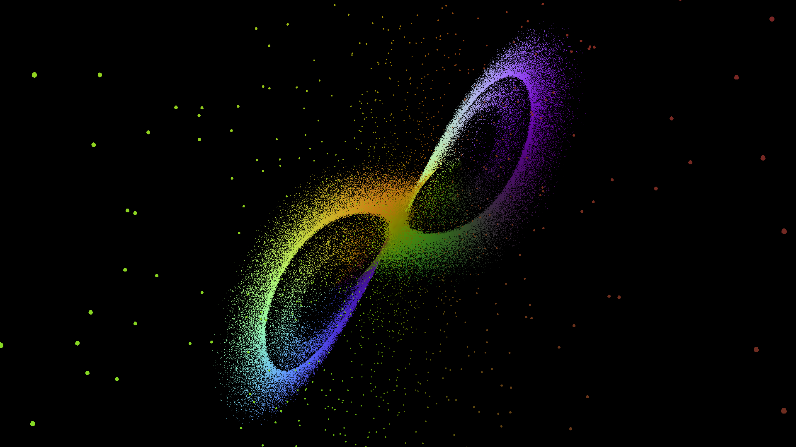

# Lorenz system particle simulation
The particles are instanced and use offsets and colors passed by SSBO from the compute shader performing all calculations. The colors of the particles are determined by their velocity vectors.
## Gallery
;
;
;